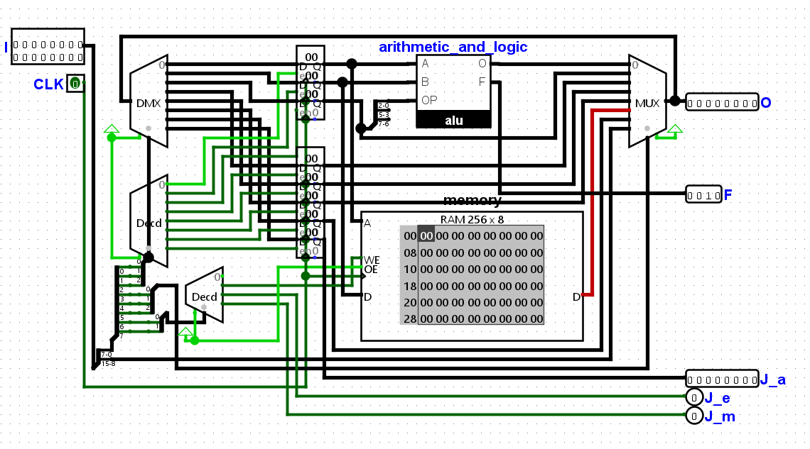

# tinyCPU
My first ever working CPU design (8-bit architecture), made in Logisim Evolution

!Unconditional jumping logic is flawed, must be fixed soon!

# INSTRUCTION SCHEME

    00000000	00 00 00 00
    --DATA--	CR-OS-RS-OP
    
    --CR---	---NOP
    	 |-WE
    	 |-JE
    	 L-JM

# FIBONACCI #

    LDA 0
    LDB 1
    ADD A, B, A
    NOT A, A	/
    NOT A, C	/ Moves A into C
    LDA 0		/
    ADD A, B, A	/ Moves B into A
    MOV C, B	/ Moves C into B
    LDJ 1		/
    JMP		/ (Program starts at 0)

# FIBONACCI DECODED #

    00000000	00 11 00 00
    00000001	00 11 01 00
    00000000	00 00 00 10
    00000000	00 00 00 01
    00000000	00 00 10 01
    00000000	00 11 00 00
    00000000	00 00 00 10
    00000000	00 10 01 00
    00000010	00 11 11 00
    00000000	10 01 10 00

# FIBONACCI HEX #

    0030
    0134
    0002
    0001
    0009
    0030
    0002
    0024
    023c
    0098
