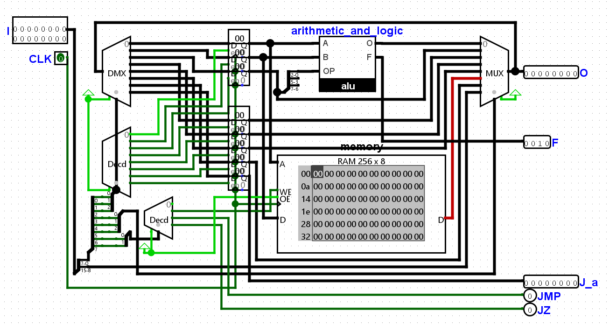

# tinyCPU
My second working CPU design (8-bit architecture), made in Logisim Evolution

# INSTRUCTION SCHEME

    00000000	00 000 000
    --DATA--	CR--OS--RS
    
    --CR---	---NOP
    	 |-WE
    	 |-JMP
    	 L-JZ

# FIBONACCI PSEUDOCODE #

(in this implementation, we avoid using the ALU operation (C) register as a general one,

so the C register in the code could be thought of as the D on the hardware, D as E and E as F)

(SOP = set operation, this just loads immediate value into the ALU operation register)

(SJA = set jump address, this just loads immediate value into the jump address register)

(LAC = load ALU output to C)

		LDC 0
		LDD 1
		SOP +
		MOV C, A
		MOV D, B
		LAC
		MOV D, E
		MOV C, D
		MOV E, C
		SJA 3
		JMP

# FIBONACCI MACHINE CODE #

		00000000	00 111 011
		00000001	00 111 100
		00000101	00 111 010
		00000000	00 010 000
		00000000	00 011 001
		00000000	00 000 011
		00000000	00 011 101
		00000000	00 010 100
		00000000	00 100 011
		00000011	00 111 111
		00000000	10 001 010

# FIBONACCI HEX ROM CODE #
		003b
		013c
		033a
		0010
		0019
		0003
		001d
		0014
		0024
		033f
		008a
